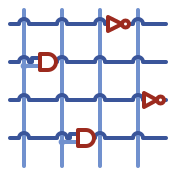

<picture>
  <source media="(prefers-color-scheme: dark)" srcset="docs/assets/jacquard-logo-dark.svg">
  
</picture>

# Jacquard


Jacquard is a GPU-accelerated RTL logic simulator. Like a Jacquard loom weaving patterns from punched cards, Jacquard maps gate-level netlists onto a virtual manycore Boolean processor and executes them on GPUs, delivering 5-40X speedup over CPU-based RTL simulators.

Jacquard builds on the excellent [GEM](https://github.com/NVlabs/GEM) research by Zizheng Guo, Yanqing Zhang, Runsheng Wang, Yibo Lin, and Haoxing Ren at NVIDIA Research. Jacquard extends their work with:

- **Metal backend** for Apple Silicon Macs (in addition to the original CUDA backend)
- **Liberty timing support** — load real cell delays from Liberty files (e.g. SKY130) for timing-annotated simulation
- **SDF back-annotation** — post-layout timing from Standard Delay Format files
- **Setup/hold violation detection** — both CPU and GPU-side checking
- **Significant performance optimizations** to the partition mapping pipeline
- **CI/CD** with automated testing across all three backends

GPU-accelerated gate-level simulation with real cell timing is live across all
three backends. For the per-backend feature status — Liberty parsing, SDF
back-annotation, setup/hold violation detection, and the structured
`--timing-report` — see **[Timing Simulation](https://gpu-eda.github.io/Jacquard/timing-simulation.html)**.
[`CHANGELOG.md`](CHANGELOG.md) tracks released and unreleased changes.

## Quick Start

> **Just want to install Jacquard?** On macOS (Apple Silicon / Metal):
>
> ```sh
> brew install gpu-eda/homebrew-tap/jacquard
> ```
>
> See **[Installation](https://gpu-eda.github.io/Jacquard/installation.html)** for `cargo binstall`,
> the prebuilt tarball, and the `netlist-graph` PyPI companion. The from-source
> build below is the contributor path — and the route for Linux CUDA / HIP.

Building from source needs the [Rust toolchain](https://rustup.rs/) (2021 edition)
and the GPU SDK for the backend you're building against. Nothing else — see
[Development](#development) for the extra tooling a few contributor workflows want.

```sh
git clone https://github.com/gpu-eda/Jacquard.git
cd Jacquard
git submodule update --init --recursive
```

### Build (Metal - macOS)

```sh
cargo build -r --features metal --bin jacquard
```

### Build (CUDA - Linux)

Requires CUDA toolkit installed.

```sh
cargo build -r --features cuda --bin jacquard
```

#### CUDA target architecture

By default the kernel is built with PTX for `compute_50` plus SASS for `sm_70`
and `sm_80`; newer GPUs run via PTX JIT at first load. To target a specific
architecture, set `JACQUARD_CUDA_ARCH`, which is passed straight to `nvcc` as
`-arch=<value>`:

```sh
# Local dev — build native SASS for the GPU in THIS machine (fastest, no
# first-load JIT). Example: an sm_120 Blackwell card.
JACQUARD_CUDA_ARCH=native cargo build -r --features cuda --bin jacquard

# Distribution — portable SASS for every major arch the toolkit knows, plus
# PTX for the newest (needs CUDA ≥ 12.8 to include Blackwell sm_100/sm_120).
JACQUARD_CUDA_ARCH=all-major cargo build -r --features cuda --bin jacquard
```

Any `nvcc` `-arch` value works (`native`, `all-major`, `all`, `sm_120`, …).
Leave it unset to keep the default behavior.

## Usage

Simulate a gate-level netlist with a VCD input waveform:

```sh
# Metal (macOS) - use NUM_BLOCKS=1
cargo run -r --features metal --bin jacquard -- sim design.gv input.vcd output.vcd 1

# CUDA (Linux) - set NUM_BLOCKS to 2x your GPU's SM count
cargo run -r --features cuda --bin jacquard -- sim design.gv input.vcd output.vcd NUM_BLOCKS

# With SDF timing back-annotation:
cargo run -r --features metal --bin jacquard -- sim design.gv input.vcd output.vcd 1 \
  --sdf design.sdf --sdf-corner typ
```

Partitioning (mapping the design to GPU blocks) happens automatically at startup.

`sim` replays a **static** VCD, which is enough when the stimulus doesn't depend
on what the design does. When it does, `jacquard cosim` runs peripheral models —
SPI flash / QSPI PSRAM, UART, JTAG (with an interactive `--jtag-server`), and
Wishbone / APB3 bus tracing — as GPU kernels alongside the design, so inputs can
react to outputs cycle by cycle.

**See [Getting Started](https://gpu-eda.github.io/Jacquard/getting-started.html)** to run bundled
designs in seconds, or the [Synthesis Flow](https://gpu-eda.github.io/Jacquard/synthesis-flow.html)
for synthesis preparation, VCD scope handling, and running your own RTL.

## Documentation

Browse the full documentation [online](https://gpu-eda.github.io/Jacquard/) or build it locally with [mdbook](https://rust-lang.github.io/mdBook/):

```sh
mdbook serve   # opens at http://localhost:3000
```

## Input

Point it at behavioral Verilog or SystemVerilog and it runs:

```sh
jacquard sim design.v input.vcd output.vcd 1
```

Synthesis happens on the way in, transparently and cached, through an embedded
Yosys engine. It needs the `synth` feature — on in release and Homebrew binaries,
`--features metal,synth` if you're building yourself — and a `yosys.wasm`. See
**[Accepted RTL Surface](https://gpu-eda.github.io/Jacquard/accepted-rtl.html)**
for the supported language subset and how to supply the wasm.

A **pre-synthesized gate-level netlist** (`design.gv`, mapped to `aigpdk` /
SKY130 / GF180MCU cells) works too, and it's the faster path: synthesis quality
sets Jacquard's speed, so a design you'll run many times is worth synthesizing
deliberately. The full flow — memory mapping plus logic synthesis to
`aigpdk.lib` — is in
[Synthesis Flow](https://gpu-eda.github.io/Jacquard/synthesis-flow.html). A
binary built without `synth` still simulates netlists, and says so clearly if
handed RTL.

Netlist syntax and SystemVerilog/SVA status:
[Input netlist language](https://gpu-eda.github.io/Jacquard/input-netlist.html).

## Limitations

- **Edge-triggered flip-flops only in the logic** — a raw `LATCH` cell in the
  gate-level netlist is rejected (async set/reset on flip-flops is fine; async
  reset is *not* the restriction). The two common structured latch uses are
  supported through their own paths: **clock gating** via the `CKLNQD`
  integrated clock-gating cell (below), and **latch / register-file memory**
  mapped through the memory-synthesis step (`memory_libmap` → RAM; see
  [Synthesis Flow](https://gpu-eda.github.io/Jacquard/synthesis-flow.html)).
- Clock gates must use `CKLNQD` (from `aigpdk.v`) or the equivalent clock-gate
  cells from the SKY130 or GF180MCU PDKs.

## Benchmarks

Pre-synthesized benchmark designs are in `benchmarks/dataset/` (git submodule). See [benchmarks/README.md](benchmarks/README.md) for instructions.

Available designs: NVDLA, Rocket, Gemmini.

## Development

Working on Jacquard itself is covered by the
**[Development guide](https://gpu-eda.github.io/Jacquard/development.html)**: how
the pipeline fits together and where each stage lives, the GPU block limits that
shape it (and what to do when a design won't map), the optional tooling a few
workflows need — `flatc`, `mdbook`, OpenSTA — and the ADR / plan / handoff
conventions.

For architecture in depth, see
[Simulation Architecture](https://gpu-eda.github.io/Jacquard/simulation-architecture.html)
and the [ADRs](https://gpu-eda.github.io/Jacquard/adr/).

## Citation

Jacquard builds on the GEM research. Please cite the original paper if you find this work useful.

``` bibtex
@inproceedings{gem,
 author = {Guo, Zizheng and Zhang, Yanqing and Wang, Runsheng and Lin, Yibo and Ren, Haoxing},
 booktitle = {Proceedings of the 62nd Annual Design Automation Conference 2025},
 organization = {IEEE},
 title = {{GEM}: {GPU}-Accelerated Emulator-Inspired {RTL} Simulation},
 year = {2025}
}
```

## License

Apache-2.0. See [LICENSE](./LICENSE) for details.
